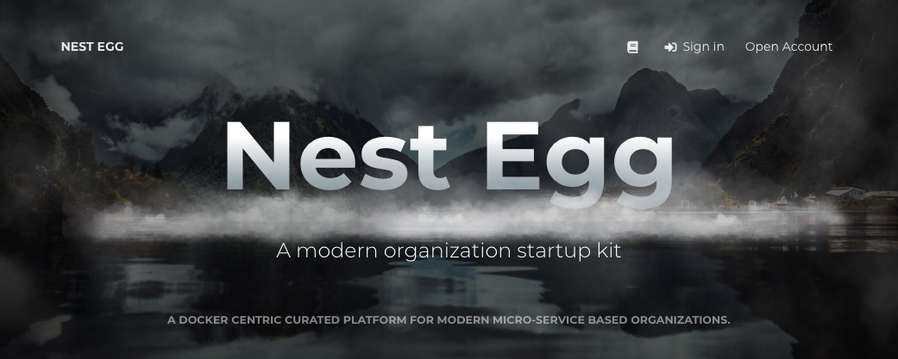

Nest Egg is a Docker centric curated platform for modern micro-service based organizations. It is a fairly large set of technologies. As such we've tried to make getting started with a working example as simple as possible. 

# Documentation
<a href="https://nestegg.gitbook.io" alt="Official Docs" target="_docs" >https://nestegg.gitbook.io</a>
