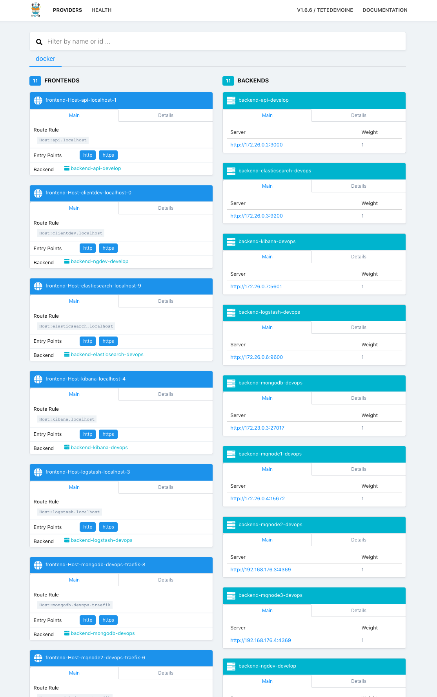

# Getting Started


Nest Egg is a Docker centric curated platform for modern micro-service based organizations. 

It is a fairly large set of technologies. As such we've tried to make getting started with a working example as simple as possible.

## Prerequisites

* Install Docker \( ver 18.10 or higher\)
* Install Git

## On a Mac/Linux

```text
mkdir nestegg
cd nestegg
git clone https://github.com/bradschafer/nestegg .
bash setup.sh
```

The setup bash script will add some folders and setup the Docker networks that NestEgg needs in order for the containers to talk to each other. The folders will store and 'share' data from your computer to the running Docker services, creating a development environment 'persistance' layer. You can edit files right from your favorite IDE and the web application will refresh on file change automatically. For transition to production environment see the 'Moving to Production' section of the documentation.

### Launch devops infratructure

```text
cd devops
docker-compose up -d
```

This will launch all main infrastructure containers and prep the host machine for running the development web server. The MongoDB can take up to a minute to start, so wait a moment prior to continuing.

The -d parameter will run these containers detached form the console in the background. You should see something like this:


Open a second tab or terminal window so you can see the console logs for the development server.

```text
cd ..
cd develop
docker-compose up
```

You should then see something like this:


If you start the development server prior to the MongoDB starting up, you will see an error. It is no big deal, as starting and stopping containers will be a breeze with the 'Portainer' management console which we will cover a bit below.

If you get an error, for now simply press **ctl-c** wait for the containers to shut down then run the docker-compose command again.

At this point we can begin to use some of the running services to do administration. Here are the main URL's you will be using:

## DevOps Services


### Portainer

[http://portainer.localhost/](http://portainer.localhost/)

### Traefik

[http://proxy.localhost/dashboard/](http://proxy.localhost/dashboard/)

### Rabbit MQ

[http://rabbitmq.localhost/\#/](http://rabbitmq.localhost/#/)

### Kibana

[http://kibana.localhost](http://kibana.localhost)

### Elastic Search

[http://elasticsearch.localhost/](http://elasticsearch.localhost/)

## Development Services

### Web Application

[http://clientdev.localhost/](http://clientdev.localhost/)

### API Documentation

[http://api.localhost/api/docs/\#/api](http://api.localhost/api/docs/#/api)

Sometimes the development URL's don't get picked up by Traefik \( the routing engine\). To remedy this we can simply 'restart' the Traefik container. To do so, you will need to use the 'restart' button in Portainer for the Traefik container.

So create an administration account in portainer and recycle it now.


Once Traefik is restarted, all the services should get found and get simple localhost domain names.

Open a browser and navigate to [http://proxy.localhost/dashboard/](http://proxy.localhost/dashboard/)

You should see something like this:



With all the services started you should now be able to open a browser and goto the front end web application.


