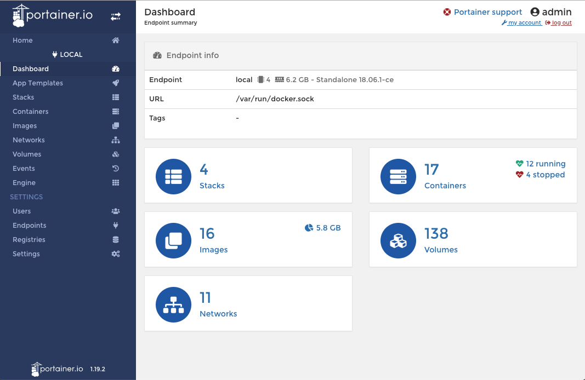

# What Just Happened?

At this point we can begin to use some of the running services to do administration, and see our new [Web Application](what-just-happened.md#web-application)

Here are the main URL's you will be using:

## DevOps Services

### Portainer

[Portainer](https://portainer.io/) is an open-source lightweight management UI which allows your to easily manage your docker hosts or swarm clusters.     
  
**development url:** [http://portainer.localhost/](http://portainer.localhost/)

### Traefik

Traefik is a modern HTTP reverse proxy and load balancer that makes deploying microservices easy. Traefik integrates with your existing infrastructure components \([Docker](https://www.docker.com/), [Swarm mode](https://docs.docker.com/engine/swarm/), [Kubernetes](https://kubernetes.io/), [Marathon](https://mesosphere.github.io/marathon/), [Consul](https://www.consul.io/), [Etcd](https://coreos.com/etcd/), [Rancher](https://rancher.com/), [Amazon ECS](https://aws.amazon.com/ecs), ...\) and configures itself automatically and dynamically. Pointing Traefik at your orchestrator should be the _only_ configuration step you need.  
  
**development url:** [http://proxy.localhost/dashboard/](http://proxy.localhost/dashboard/)

### Rabbit MQ

[RabbitMQ](http://www.rabbitmq.com/) is the most widely deployed open source message broker. RabbitMQ is lightweight and easy to deploy on premises and in the cloud. It supports multiple messaging protocols. RabbitMQ can be deployed in distributed and federated configurations to meet high-scale, high-availability requirements.

**development url:**  [http://rabbitmq.localhost/\#/](http://rabbitmq.localhost/#/)

## The ELK Stack

### Kibana

[Kibana](https://www.elastic.co/products/kibana) lets you visualize your Elasticsearch data and navigate the ELK Stack. Kibana provides data exploration, visualization, and dashboarding. 

**development url:** [http://kibana.localhost](http://kibana.localhost)

### Elastic Search

[Elasticsearch](https://www.elastic.co/products/elasticsearch) is a distributed, RESTful search and analytics engine capable of solving a growing number of use cases. As the heart of the Elastic Stack, it centrally stores your data so you can discover the expected and uncover the unexpected.

**development url:**  [http://elasticsearch.localhost/](http://elasticsearch.localhost/)

## Development Services

### Web Application

[http://clientdev.localhost/](http://clientdev.localhost/)

### API Documentation

[http://api.localhost/api/docs/\#/api](http://api.localhost/api/docs/#/api)

Sometimes the development URL's don't get picked up by Traefik \( the routing engine\). To remedy this we can simply 'restart' the Traefik container. To do so, you will need to use the 'restart' button in Portainer for the Traefik container.

So create an administration account in portainer and recycle it now.

Once Traefik is restarted, all the services should get found and get simple localhost domain names.

Open a browser and navigate to [http://proxy.localhost/dashboard/](http://proxy.localhost/dashboard/)

You should see something like this:

